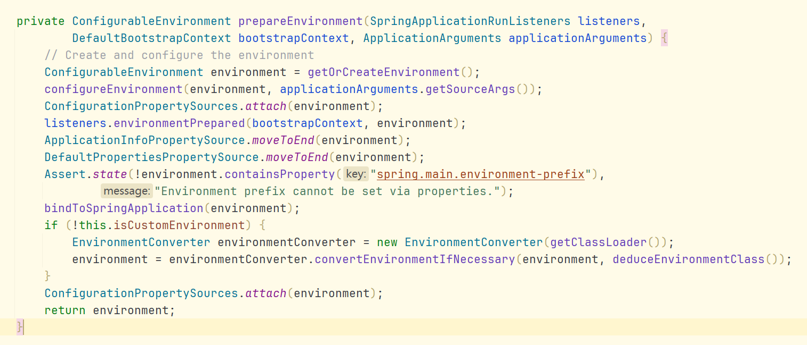

```java

import org.springframework.boot.SpringApplication;
import org.springframework.boot.autoconfigure.SpringBootApplication;
@SpringBootApplication
public class MySpringBootApp {
    public static void main(String[] args) {
        SpringApplication.run(MySpringBootApp.class, args);
    }
}
```


---

先看new


事件监听器和初始化器都是从springFactory中初始化拿到的，通过setter方法注入实现
deduceMainApplication仅仅是推断出所在的主类

----

new已经实现了，接下来看run是如何实现的



接下来逐行拆解

环境对象实现
构建并准备 Environment 环境对象，包含以下几个来源：
- application.properties / application.yml
- 系统环境变量（System.getenv()）
- 系统属性（System.getProperties()）
- 命令行参数
- 同时还会触发：
1. 触发监听器 EnvironmentPreparedEvent
2. 设置 activeProfiles
3. 加载配置文件

打印Banner，也可以通过自定义在banner.txt

根据当前 Web 应用类型，动态选择合适的 ApplicationContext 实现类，并创建它的实例。

| `WebApplicationType` | 实际创建的容器类                                              |
| -------------------- | ----------------------------------------------------- |
| `SERVLET`            | `AnnotationConfigServletWebServerApplicationContext`  |
| `REACTIVE`           | `AnnotationConfigReactiveWebServerApplicationContext` |
| `NONE`               | `GenericApplicationContext`                           |


拿servelet举例，会返回一个内嵌 Servlet 容器（如 Tomcat）的 IOC 容器。

如果启用了启动监控（ApplicationStartup），用于记录容器启动过程中的性能指标

--- 

接下来是最难的，也是重头戏
设置环境、注册配置类、注册内部 Bean、执行初始化器


第一次把@SpringBootApplication标记的主类作为配置类加载进来

也就是说，在此时
1. MyApplication 被注册为一个配置类（带有 @Configuration）
2. 它的 @ComponentScan 会扫描当前包及子包的所有组件（@Component、@Service、@RestController 等）
3. @EnableAutoConfiguration 会触发加载 spring-boot-autoconfigure 包里的所有自动配置类（通过 SPI）

而@EnableAutoConfiguration 利用了 @Import(AutoConfigurationImportSelector.class) 动态读取 spring.factories 或 .imports 文件中所有自动配置类，条件判断通过后注册为 BeanDefinition，等待容器 refresh() 时生效。


结果就是：
执行完 load(...) 后：
1. 应用主类被注册为配置类（Bean）
2. 所有自动配置类的 @Conditional 条件将开始生效
3. 所有组件会被作为 BeanDefinition 注册进 BeanFactory (指xml、@Component、@Bean)
4. 这些信息会在下一步 refresh() 时被实例化。

```
ConfigurationClassPostProcessor
  → postProcessBeanDefinitionRegistry()
    → processConfigBeanDefinitions()
      → doProcessConfigurationClass()
        → 扫描 @ComponentScan
        → 解析 @Import/@Bean
        → 注册成 BeanDefinition 到 BeanFactory
```


可以这么说，负责把启动类和配置类注册进 IOC 容器，为后续 refresh() 时 Bean 的创建做好准备，是 Spring Boot 自动配置生效的关键步骤之一。


---
接下来看refresh

注册了一个jvm钩子，当jvm被关掉的时候，会自动清理spring资源

接下来就是refresh，实际调用的是applicationContext.refresh();


拿servelet的为例


收集早期事件，同时校验环境


Spring 通过这个类加载器反射构造 Bean、加载配置类等。默认是 AppClassLoader，也支持定制（如模块化运行时）。
此时需要 StandardBeanExpressionResolver 去解析 ${}、#{} 等 Spring EL 表达式。
即使配置文件是字符串，Spring 会用 PropertyEditor 自动转换为 int，需要注册转换器。
看不完了，很多。。。
一言以蔽之，这里代码是在核心基础设施、注入机制、以及默认的系统组件。


接下来来看，servlet重写的postProcessorFacotry方法。

注册一个 BeanPostProcessor，专门在 Bean 初始化阶段自动注入 ServletContext

举个例子

```java
public class MyBean implements ServletContextAware {
    public void setServletContext(ServletContext servletContext) {
        // 注入的 servletContext 可用
    }
}
```

Spring 就会在实例化 MyBean 后，调用 setServletContext() 方法，注入当前 Web 环境的 ServletContext 对象。

接下来的ignoreDependencyInterface，告诉 Spring：不要尝试通过 @Autowired 或构造器等自动注入 ServletContextAware 接口。

因为 Spring 会通过上面注册的 BeanPostProcessor 来单独处理这些接口，所以这里让容器跳过它，避免冲突或多次注入。


| 作用域名            | Scope 实现类             | 说明                          |
| --------------- | --------------------- | --------------------------- |
| `"request"`     | `RequestScope`        | 每个 HTTP 请求一个 Bean           |
| `"session"`     | `SessionScope`        | 每个 HTTP 会话一个 Bean           |
| `"application"` | `ServletContextScope` | 整个 ServletContext 共享一个 Bean |


恢复现场，防止用户自定义作用域被覆盖

上面的代码主要实现了一个Spring Web 容器能使用标准 Web 作用域

这段代码的主要作用是让 Spring 容器支持 Web 特性（如 ServletContext 注入、Web作用域 Bean），是将普通 Spring 容器变成 Web 容器的关键一步。

---
这个代码就更关键了，是Spring识别@Component、xml配置、@Bean的关键一步


执行所有 BeanFactoryPostProcessor

注册特殊的编织增强支持（JPA 或 AOP 场景）

- 用户主动添加的（通过 application.addBeanFactoryPostProcessor(...)）
- Spring 自动注册的（如 ConfigurationClassPostProcessor）：
  - 解析 @Configuration 类
  - 执行 @ComponentScan
  - 解析 @Import、@Bean
  - 注册这些扫描结果为 BeanDefinition

后面的if就没什么意思了，主要是对于特殊情况的特判

接下来看这个核心方法 invokeBeanFactoryPostProcessors


```java
public static void invokeBeanFactoryPostProcessors(
        ConfigurableListableBeanFactory beanFactory,
        List<BeanFactoryPostProcessor> beanFactoryPostProcessors) {

    // 用于记录已执行过的 Bean 名称，防止重复执行
    Set<String> processedBeans = new HashSet<>();

    // 判断是否支持注册 BeanDefinition 的能力（支持动态注册），如常见的 DefaultListableBeanFactory
    if (beanFactory instanceof BeanDefinitionRegistry registry) {

        // regular：普通 BeanFactoryPostProcessor（不负责注册 BeanDefinition）
        // registry：BeanDefinitionRegistryPostProcessor（负责注册/修改 BeanDefinition）
        List<BeanFactoryPostProcessor> regularPostProcessors = new ArrayList<>();
        List<BeanDefinitionRegistryPostProcessor> registryProcessors = new ArrayList<>();

        // 先处理开发者手动添加的 BeanFactoryPostProcessor
        for (BeanFactoryPostProcessor postProcessor : beanFactoryPostProcessors) {
            if (postProcessor instanceof BeanDefinitionRegistryPostProcessor registryProcessor) {
                // 立即执行注册方法（扫描/注册新的BeanDefinition）
                registryProcessor.postProcessBeanDefinitionRegistry(registry);
                registryProcessors.add(registryProcessor);
            } else {
                regularPostProcessors.add(postProcessor);
            }
        }

        // 当前批次处理器
        List<BeanDefinitionRegistryPostProcessor> currentRegistryProcessors = new ArrayList<>();

        // 第一批：容器中实现了 PriorityOrdered 的 BeanDefinitionRegistryPostProcessor
        String[] postProcessorNames =
                beanFactory.getBeanNamesForType(BeanDefinitionRegistryPostProcessor.class, true, false);
        for (String ppName : postProcessorNames) {
            if (beanFactory.isTypeMatch(ppName, PriorityOrdered.class)) {
                currentRegistryProcessors.add(
                        beanFactory.getBean(ppName, BeanDefinitionRegistryPostProcessor.class));
                processedBeans.add(ppName);
            }
        }

        sortPostProcessors(currentRegistryProcessors, beanFactory);
        registryProcessors.addAll(currentRegistryProcessors);
        invokeBeanDefinitionRegistryPostProcessors(currentRegistryProcessors, registry, beanFactory.getApplicationStartup());
        currentRegistryProcessors.clear();

        // 第二批：实现了 Ordered（但不是 PriorityOrdered）的处理器
        postProcessorNames =
                beanFactory.getBeanNamesForType(BeanDefinitionRegistryPostProcessor.class, true, false);
        for (String ppName : postProcessorNames) {
            if (!processedBeans.contains(ppName)
                    && beanFactory.isTypeMatch(ppName, Ordered.class)) {
                currentRegistryProcessors.add(
                        beanFactory.getBean(ppName, BeanDefinitionRegistryPostProcessor.class));
                processedBeans.add(ppName);
            }
        }

        sortPostProcessors(currentRegistryProcessors, beanFactory);
        registryProcessors.addAll(currentRegistryProcessors);
        invokeBeanDefinitionRegistryPostProcessors(currentRegistryProcessors, registry, beanFactory.getApplicationStartup());
        currentRegistryProcessors.clear();

        // 第三批：普通无序的 BeanDefinitionRegistryPostProcessor
        boolean reiterate = true;
        while (reiterate) {
            reiterate = false;
            postProcessorNames =
                    beanFactory.getBeanNamesForType(BeanDefinitionRegistryPostProcessor.class, true, false);
            for (String ppName : postProcessorNames) {
                if (!processedBeans.contains(ppName)) {
                    currentRegistryProcessors.add(
                            beanFactory.getBean(ppName, BeanDefinitionRegistryPostProcessor.class));
                    processedBeans.add(ppName);
                    reiterate = true;
                }
            }

            sortPostProcessors(currentRegistryProcessors, beanFactory);
            registryProcessors.addAll(currentRegistryProcessors);
            invokeBeanDefinitionRegistryPostProcessors(currentRegistryProcessors, registry, beanFactory.getApplicationStartup());
            currentRegistryProcessors.clear();
        }

        // 执行所有 BeanDefinitionRegistryPostProcessor 的 postProcessBeanFactory 方法
        invokeBeanFactoryPostProcessors(registryProcessors, beanFactory);

        // 执行手动添加的 BeanFactoryPostProcessor
        invokeBeanFactoryPostProcessors(regularPostProcessors, beanFactory);

    } else {
        // 对于不是 BeanDefinitionRegistry 的容器，直接执行传入的 BeanFactoryPostProcessor
        invokeBeanFactoryPostProcessors(beanFactoryPostProcessors, beanFactory);
    }

    // 处理所有容器中还未执行的 BeanFactoryPostProcessor（不是 Registry 的）
    String[] postProcessorNames =
            beanFactory.getBeanNamesForType(BeanFactoryPostProcessor.class, true, false);
    List<BeanFactoryPostProcessor> priorityOrderedPostProcessors = new ArrayList<>();
    List<String> orderedPostProcessorNames = new ArrayList<>();
    List<String> nonOrderedPostProcessorNames = new ArrayList<>();

    // 分类 PriorityOrdered、Ordered、无序 三批
    for (String ppName : postProcessorNames) {
        if (!processedBeans.contains(ppName)) {
            if (beanFactory.isTypeMatch(ppName, PriorityOrdered.class)) {
                priorityOrderedPostProcessors.add(
                        beanFactory.getBean(ppName, BeanFactoryPostProcessor.class));
            } else if (beanFactory.isTypeMatch(ppName, Ordered.class)) {
                orderedPostProcessorNames.add(ppName);
            } else {
                nonOrderedPostProcessorNames.add(ppName);
            }
        }
    }

    // 执行 PriorityOrdered 的
    sortPostProcessors(priorityOrderedPostProcessors, beanFactory);
    invokeBeanFactoryPostProcessors(priorityOrderedPostProcessors, beanFactory);

    // 执行 Ordered 的
    List<BeanFactoryPostProcessor> orderedPostProcessors =
            new ArrayList<>(orderedPostProcessorNames.size());
    for (String postProcessorName : orderedPostProcessorNames) {
        orderedPostProcessors.add(
                beanFactory.getBean(postProcessorName, BeanFactoryPostProcessor.class));
    }
    sortPostProcessors(orderedPostProcessors, beanFactory);
    invokeBeanFactoryPostProcessors(orderedPostProcessors, beanFactory);

    // 执行无序的
    List<BeanFactoryPostProcessor> nonOrderedPostProcessors =
            new ArrayList<>(nonOrderedPostProcessorNames.size());
    for (String postProcessorName : nonOrderedPostProcessorNames) {
        nonOrderedPostProcessors.add(
                beanFactory.getBean(postProcessorName, BeanFactoryPostProcessor.class));
    }
    invokeBeanFactoryPostProcessors(nonOrderedPostProcessors, beanFactory);

    // 最后：清除合并的 BeanDefinition 缓存，避免后续创建 Bean 时用到旧数据
    beanFactory.clearMetadataCache();
}


```


```
├── 1. 分出手动注册的 PostProcessor 中的 Registry 和 普通类
│     ├── 立即执行手动的 RegistryProcessor
│     └── 留下 regularPostProcessor 暂时不动
│
├── 2. 查找容器中定义的所有 RegistryPostProcessor
│     ├── PriorityOrdered
│     ├── Ordered
│     └── 普通无序
│     ↪ 每一批都执行：registryProcessor.postProcessBeanDefinitionRegistry()
│
├── 3. 执行 registryProcessors 的 postProcessBeanFactory()
├── 4. 执行 regularPostProcessors 的 postProcessBeanFactory()
│
├── 5. 查找所有 BeanFactoryPostProcessor（但不是 Registry 的）
│     ├── PriorityOrdered
│     ├── Ordered
│     └── 无序
│     ↪ 分批执行 postProcessBeanFactory()
│
└── 6. 清理 BeanFactory 的缓存（因 BD 被动态注册/修改）

```


Spring 是通过判断 Bean 是否实现了 PriorityOrdered / Ordered 接口，分三批有序地执行 BeanDefinitionRegistryPostProcessor，从而确保关键配置优先执行，普通配置后执行，保持容器初始化的可控性和扩展性。

可以关注ConfigurationClassPostProcessor 是怎么插入这个队列并优先执行的，深入 META-INF/spring.factories -> AutoConfigurationImportSelector 的流程。（Spring 在容器启动初始化时，会通过 SpringFactoriesLoader 加载所有自动注册的后处理器，包括 BeanFactoryPostProcessor / ApplicationContextInitializer 等）

也就是说这个代码，处理配置类、@ComponentScan、@Import 等注解，注册和解析所有 BeanDefinition（只是注册，还没创建对象！）

--- 

下面就开始创建了


```java

public static void registerBeanPostProcessors(ConfigurableListableBeanFactory beanFactory, AbstractApplicationContext applicationContext) {

    // 1️获取容器中所有 BeanPostProcessor 的名称（此时还没实例化）
    String[] postProcessorNames = beanFactory.getBeanNamesForType(BeanPostProcessor.class, true, false);

    // 计算目标总数 = 当前已注册 + 预计将要注册 + 1（BeanPostProcessorChecker）
    int beanProcessorTargetCount = beanFactory.getBeanPostProcessorCount() + 1 + postProcessorNames.length;

    // 注册一个特殊的校验处理器：用于记录哪些 Bean 在所有处理器未注册完就被创建（可能未被增强）
    beanFactory.addBeanPostProcessor(new BeanPostProcessorChecker(beanFactory, postProcessorNames, beanProcessorTargetCount));

    // 初始化分类容器
    List<BeanPostProcessor> priorityOrderedPostProcessors = new ArrayList<>();
    List<BeanPostProcessor> internalPostProcessors = new ArrayList<>();
    List<String> orderedPostProcessorNames = new ArrayList<>();
    List<String> nonOrderedPostProcessorNames = new ArrayList<>();

    // 遍历所有名称，根据是否实现 PriorityOrdered / Ordered 分类
    for (String ppName : postProcessorNames) {
        if (beanFactory.isTypeMatch(ppName, PriorityOrdered.class)) {
            BeanPostProcessor pp = beanFactory.getBean(ppName, BeanPostProcessor.class);
            priorityOrderedPostProcessors.add(pp);
            if (pp instanceof MergedBeanDefinitionPostProcessor) {
                internalPostProcessors.add(pp);
            }
        } else if (beanFactory.isTypeMatch(ppName, Ordered.class)) {
            orderedPostProcessorNames.add(ppName);
        } else {
            nonOrderedPostProcessorNames.add(ppName);
        }
    }

    // 注册 PriorityOrdered 组
    sortPostProcessors(priorityOrderedPostProcessors, beanFactory);
    registerBeanPostProcessors(beanFactory, priorityOrderedPostProcessors);

    // 注册 Ordered 组
    List<BeanPostProcessor> orderedPostProcessors = new ArrayList<>(orderedPostProcessorNames.size());
    for (String ppName : orderedPostProcessorNames) {
        BeanPostProcessor pp = beanFactory.getBean(ppName, BeanPostProcessor.class);
        orderedPostProcessors.add(pp);
        if (pp instanceof MergedBeanDefinitionPostProcessor) {
            internalPostProcessors.add(pp);
        }
    }
    sortPostProcessors(orderedPostProcessors, beanFactory);
    registerBeanPostProcessors(beanFactory, orderedPostProcessors);

    // 注册无序组
    List<BeanPostProcessor> nonOrderedPostProcessors = new ArrayList<>(nonOrderedPostProcessorNames.size());
    for (String ppName : nonOrderedPostProcessorNames) {
        BeanPostProcessor pp = beanFactory.getBean(ppName, BeanPostProcessor.class);
        nonOrderedPostProcessors.add(pp);
        if (pp instanceof MergedBeanDefinitionPostProcessor) {
            internalPostProcessors.add(pp);
        }
    }
    registerBeanPostProcessors(beanFactory, nonOrderedPostProcessors);

    // 注册 internal 类型（MergedBeanDefinitionPostProcessor，最后执行）
    sortPostProcessors(internalPostProcessors, beanFactory);
    registerBeanPostProcessors(beanFactory, internalPostProcessors);

    // 注册 ApplicationListenerDetector，自动识别实现 ApplicationListener 的 bean
    beanFactory.addBeanPostProcessor(new ApplicationListenerDetector(applicationContext));
}

```

```
┌──────────────────────────────┐
│ registerBeanPostProcessors()│
└──────────────┬───────────────┘
               │
               ▼
  获取所有 BeanPostProcessor 名称
               │
               ▼
  添加 BeanPostProcessorChecker（记录日志）
               │
               ▼
   分类处理：
   ├─ PriorityOrdered ➤ 立即实例化 ➤ 排序 ➤ 注册
   ├─ Ordered         ➤ 延迟实例化 ➤ 排序 ➤ 注册
   ├─ 无序            ➤ 延迟实例化 ➤ 注册
   │
   └─ internal (MergedBeanDefinitionPostProcessor)
        ➤ 从上述中筛选出来 ➤ 最后统一排序注册
               │
               ▼
  注册 ApplicationListenerDetector（监听器探测）

```


| 类名                                       | 作用                              | 所属组             |
| ---------------------------------------- | ------------------------------- | --------------- |
| `AutowiredAnnotationBeanPostProcessor`   | 处理 `@Autowired`                 | internal        |
| `CommonAnnotationBeanPostProcessor`      | 处理 `@Resource`、`@PostConstruct` | internal        |
| `ApplicationContextAwareProcessor`       | 注入 `ApplicationContext` 等       | PriorityOrdered |
| `AnnotationAwareAspectJAutoProxyCreator` | 实现 AOP 自动代理                     | Ordered         |
| 你自己写的 `MyBeanPostProcessor`              | 自定义逻辑增强                         | 取决于是否实现了接口      |

作用：
1. 扫描并实例化所有 BeanPostProcessor 类型的 Bean（比如 AutowiredAnnotationBeanPostProcessor），并注册到 BeanFactory。
2. BeanPostProcessor 是“实例级”后置处理器，负责拦截普通 Bean 的实例化和初始化过程，完成依赖注入、AOP 等。
3. 这是所有 Bean 实例化前的关键步骤，它保证后面实例化普通 Bean 时，注入和增强能正常执行。

---


实现了i18n


初始化事件广播器 ApplicationEventMulticaster,构建并管理事件发布和监听机制，使得应用组件可以通过事件解耦协作。


onfresh()启动tomcat，因为此时Bean已经注册完了。


Spring 容器启动时注册事件监听器并发布早期事件

---


```java
protected void finishBeanFactoryInitialization(ConfigurableListableBeanFactory beanFactory) {
    // 如果容器中有名为 bootstrapExecutor 的 Executor 类型 Bean，则设置给 BeanFactory 用于启动相关异步任务
    if (beanFactory.containsBean("bootstrapExecutor") && beanFactory.isTypeMatch("bootstrapExecutor", Executor.class)) {
        beanFactory.setBootstrapExecutor((Executor)beanFactory.getBean("bootstrapExecutor", Executor.class));
    }

    // 如果容器中有名为 conversionService 的 ConversionService 类型 Bean，则设置给 BeanFactory 用于类型转换
    if (beanFactory.containsBean("conversionService") && beanFactory.isTypeMatch("conversionService", ConversionService.class)) {
        beanFactory.setConversionService((ConversionService)beanFactory.getBean("conversionService", ConversionService.class));
    }

    // 如果 BeanFactory 没有配置字符串解析器（如占位符解析），则添加一个，支持环境变量和属性占位符替换
    if (!beanFactory.hasEmbeddedValueResolver()) {
        beanFactory.addEmbeddedValueResolver((strVal) -> this.getEnvironment().resolvePlaceholders(strVal));
    }

    // 获取所有实现了 BeanFactoryInitializer 接口的 Bean 的名字，依次调用它们的 initialize 方法进行初始化
    String[] initializerNames = beanFactory.getBeanNamesForType(BeanFactoryInitializer.class, false, false);
    for(String initializerName : initializerNames) {
        ((BeanFactoryInitializer)beanFactory.getBean(initializerName, BeanFactoryInitializer.class)).initialize(beanFactory);
    }

    // 获取所有实现了 LoadTimeWeaverAware 接口的 Bean 的名字，尝试进行初始化（通常用于类加载时织入操作）
    String[] weaverAwareNames = beanFactory.getBeanNamesForType(LoadTimeWeaverAware.class, false, false);
    for(String weaverAwareName : weaverAwareNames) {
        try {
            beanFactory.getBean(weaverAwareName, LoadTimeWeaverAware.class);
        } catch (BeanNotOfRequiredTypeException ex) {
            // 如果类型不匹配，输出调试日志
            if (this.logger.isDebugEnabled()) {
                this.logger.debug("Failed to initialize LoadTimeWeaverAware bean '" + weaverAwareName +
                    "' due to unexpected type mismatch: " + ex.getMessage());
            }
        }
    }

    // 取消临时类加载器（一般用于类型匹配等特定阶段）
    beanFactory.setTempClassLoader((ClassLoader)null);

    // 锁定配置，不允许再修改 Bean 定义，保证容器配置稳定
    beanFactory.freezeConfiguration();

    // 预实例化所有非延迟加载的单例 Bean，触发它们的构造和初始化流程
    beanFactory.preInstantiateSingletons();
}

```

这里可以看出明显区别
| 操作                           | 是否立即实例化所有 Bean？                   | 说明                                 |
| ---------------------------- | --------------------------------- | ---------------------------------- |
| `registerBeanPostProcessors` | 否（只实例化 BeanPostProcessor 类型 Bean） | 只实例化后置处理器，为后续 Bean 创建流程做准备         |
| `preInstantiateSingletons()` | 是                                 | 预实例化所有非延迟加载的单例 Bean，触发业务 Bean 的实例化 |


这里的话就比较重要了，我觉得可以算是Spring的核心代码。
先说结论，必须得先实例化BeanPostProcessor类型的Bean，像是AutowiredAnnotationBeanPostProcessor、AOP，然后才能实例化业务Bean，像是@Controller等

其实也很好理解，所有的@Component都是使用了无参构造， 如果先实例化业务Bean，那些@Autowired字段就变成了null。

如果这时候先实例化 Bean 对象，它里面 @Autowired 标记的字段仍然是 null，因为注入逻辑没走。后续如果想“再去注入”，就相当于给一个已经构造好的对象修改字段，或者调用 setter，这样的操作不能被透明控制，也无法统一管理生命周期。

来个简单demo加强一下理解 
```java

@Component
class MyService {
    @Autowired
    private MyRepository repository;
    public void doSomething() {
        System.out.println("Use repository: " + repository);
    }
}

@Component
class MyRepository {
}

```

Spring 容器启动时，流程简化为：

1. Spring先扫描并实例化所有BeanPostProcessor
容器找到 AutowiredAnnotationBeanPostProcessor（它负责识别并注入@Autowired注解的字段）。
它被实例化并注册到容器，变成一个“拦截器”。

2. 容器开始实例化普通 Bean（MyService、MyRepository）
实例化 MyRepository（普通Bean），执行初始化。
实例化 MyService，但在初始化前，容器调用所有注册的 BeanPostProcessor。
AutowiredAnnotationBeanPostProcessor 发现 MyService 的 repository 字段有 @Autowired，就帮你自动注入了 MyRepository 的实例。

3. 结果
MyService#doSomething();
// 输出：Use repository: com.example.MyRepository@xxxxxx
MyService 能正常拿到注入的 MyRepository。


> Q: 如果BeanPostProcessor后注册，会发生什么？
> A: 普通 Bean 实例化时，没有 AutowiredAnnotationBeanPostProcessor，所以不会执行注入逻辑。
>   MyService.repository 就是 null。
>   你调用 doSomething() 会报空指针异常。

| 阶段                       | 作用                                                 |
| ------------------------ | -------------------------------------------------- |
| 扫描并实例化 BeanPostProcessor | 实例化 `AutowiredAnnotationBeanPostProcessor` 等，准备拦截器 |
| 注册 BeanPostProcessor     | 容器保存拦截器列表                                          |
| 实例化普通 Bean               | 创建业务 Bean 实例                                       |
| 调用 BeanPostProcessor     | 拦截器执行依赖注入、代理等逻辑                                    |


1. Spring 为什么把依赖注入放到 BeanPostProcessor 阶段？
- Spring 设计了 BeanPostProcessor 机制，允许在 Bean 完成实例化但初始化前、初始化后拦截 Bean。
- AutowiredAnnotationBeanPostProcessor 就是利用这个机制在 Bean 初始化前，扫描 @Autowired 字段并完成注入。
- 这样保证：
  - 所有依赖注入都是统一控制的，不用依赖 Bean 自己的构造器逻辑。
  - 支持循环依赖处理，因为先创建对象实例，再注入依赖。
  - 方便扩展，例如 AOP 的动态代理，也是在 BeanPostProcessor 里通过替换 Bean 实例实现。

2. 构造函数注入是怎么回事？
- 如果你用的是构造函数注入（@Autowired 标记构造函数参数），Spring 会在实例化 Bean 前，先解析依赖（提前找对应的 Bean 实例），然后调用带参数的构造函数创建 Bean。
- 这是构造时注入，和字段注入（@Autowired 字段）不同，字段注入必须实例化后才能注入，还是靠 BeanPostProcessor。

3. 为什么依赖注入需要“先有实例，再注入”，而不是构造器里注入所有？
- 对于字段注入和 setter 注入，先实例化空壳对象，再注入属性，生命周期更灵活。
- 对于动态代理（如事务 AOP），如果实例化完立刻使用原始对象，注入后不能动态替换，增强失败。
- BeanPostProcessor 可以在初始化完成前，用代理对象替换原始 Bean，实现透明增强。

4. 如果“先实例化组件”，注入时组件还没准备好怎么办？
- Spring 的“提前暴露单例对象引用”机制，结合 BeanPostProcessor 可以解决循环依赖。
- 如果你先实例化所有组件再注入，难以解决循环依赖，可能导致死锁或空指针。

其实是因为@Autowired注入时依赖的 Bean 会先被实例化（递归依赖树的先后顺序）
但严格来说，@Autowired 只是“注入点”，它不创建 Bean，Bean 的注册时机统一，实例化是动态、递归顺序执行的。
至于怎么解决循环依赖，这就要上三级缓存？了 // todo

--- 


1. resetCommonCaches()
作用：清理 Spring 中的一些常用缓存（如反射信息、Class 解析缓存）。
目的：释放内存，避免旧缓存干扰后续容器行为，提升运行期稳定性。

2. clearResourceCaches()
作用：清除类路径（classpath）下资源解析时产生的缓存。
场景：当你配置了多个 XML 配置文件、静态资源时，会通过 PathMatchingResourcePatternResolver 加载，可能缓存路径结果。

3. initLifecycleProcessor()
作用：初始化一个 LifecycleProcessor 实例（默认是 DefaultLifecycleProcessor）。
意义：生命周期管理器，专门用于在容器刷新完毕或关闭时调用 Lifecycle 类型的 Bean（如启动线程池、关闭服务等）。

4. getLifecycleProcessor().onRefresh()
作用：触发所有实现了 Lifecycle 或 SmartLifecycle 接口的 Bean 的 start() 方法。
典型应用场景：
- 启动定时任务（如 Spring Scheduling）
- 启动消息队列监听器（如 Kafka、RabbitMQ）
- 启动自定义的长连接服务（如 Netty）

5. publishEvent(new ContextRefreshedEvent(this))
作用：发布 ContextRefreshedEvent 事件，表示容器已初始化完成。

用途：所有实现了 ApplicationListener<ContextRefreshedEvent> 的监听器都可以收到通知，用于做额外的初始化逻辑。
```java
@Component
public class MyListener implements ApplicationListener<ContextRefreshedEvent> {
    @Override
    public void onApplicationEvent(ContextRefreshedEvent event) {
        System.out.println("容器刷新完毕，可启动业务逻辑！");
    }
}
```

---

afterRefresh 是 Spring Boot 在整个 ApplicationContext 刷新完成后 调用的回调。

但我在当前语境下发现这个方法是一个空的，故姑且略过

思考了一下和@PostConstruct的区别

@PostConstruct的声明周期属于当前Bean的，在Bean实例化后，即可执行。
static类加载时执行，早于实例化
而afterRefresh的声明周期则是属于整个Spring的，在Spring的所有Bean都加载完成之后，进行的afterRefresh操作。

// todo 待补充， 在遇到相应的场合之后再补充。

----

再回到高亮处


调用所有注册的 SpringApplicationRunListener 的 started() 方法，一般都是框架层面自己实现的，当然你也可以自己实现。


---


这个方法会找到所有实现了Runner接口的bean，并执行其中的结果。
同时也可以通过@Order来实现管理。
> 但我觉得有点蠢，怎么实现一个DAG？
> SpringBoot原生并不支持DAG
- ApplicationRunner：接收解析后的命令行参数（ApplicationArguments）
- CommandLineRunner：接收原始命令行参数（String[]）

为什么不用@Component？因为那个是Bean结束后执行，可能会存在不同Bean之间有依赖

---

SpringBoot的启动流程就已经全部结束了，SpringBoot真的是太复杂了。

---

接下来是小答疑时间

经常在开发中，对于Bean到底注册了没，Autowired到底实例化了没，这个实例到底是不是Null存在困惑。

同时如果项目依赖于注册中心和各种上游下游，排查起来会非常困难（因为你本地起不起来，只能发到机器上，但机器上的debug又存在滞后性，你得先启起来才能进行排查）

那如果我想要监听所有注册的Bean，有什么方法吗？

在上面的文章中我们发现，BeanPostProcessor，而业务Bean是在他们初始化之后才会实例化的

因此有几个解决方案：

| 排查点                  | 作用描述                                  | 典型实现类                                       | 生效时机（Spring启动阶段 & 代码）                                                                                                                                                                                                       | 为什么有效（排查原理）                                                |
| -------------------- | ------------------------------------- | ------------------------------------------- | --------------------------------------------------------------------------------------------------------------------------------------------------------------------------------------------------------------------------- | ---------------------------------------------------------- |
| 1. Bean 是否被注册        | 打印所有已注册的 Bean 定义，确认目标 Bean 是否存在       | 实现 `BeanDefinitionRegistryPostProcessor` 的类 | **refresh() 执行时，调用 `invokeBeanFactoryPostProcessors(beanFactory)`**，内部会调用<br>`BeanDefinitionRegistryPostProcessor.postProcessBeanDefinitionRegistry()`<br>此时：Bean 定义已加载，Bean 实例还未创建。                                        | Bean 定义是 Spring 管理 Bean 的元信息，若 Bean 未注册，后续注入必然失败。          |
| 2. @Autowired 注入检测   | 检测 @Autowired 注解的字段是否成功注入             | 实现 `BeanPostProcessor` 的类                   | 在 Bean 实例化阶段，调用 `registerBeanPostProcessors(beanFactory)` 注册所有 `BeanPostProcessor`，<br>在 Bean 初始化过程中，`AutowiredAnnotationBeanPostProcessor` 会注入依赖。<br>自定义 BeanPostProcessor 的 `postProcessAfterInitialization()` 可检测注入是否成功。 | `BeanPostProcessor` 可拦截 Bean 生命周期，观察注入字段是否为 null，判断注入是否成功。 |
| 3. 业务 Bean 是否被实例化    | 跟踪关键业务 Bean 的实例化过程                    | 实现 `BeanPostProcessor` 的类                   | 在 `finishBeanFactoryInitialization(beanFactory)` 里调用 `preInstantiateSingletons()`<br>该方法实例化所有非延迟单例 Bean，<br>期间调用所有 BeanPostProcessor，触发自定义日志打印。                                                                             | 业务 Bean 实例化失败或未实例化，会直接影响注入，跟踪实例化过程有助于定位。                   |
| 4. 结合 Spring Boot 日志 | 开启 DEBUG 日志，观察依赖解析、循环依赖、Bean 实例化等详细日志 | 无代码实现，只是配置日志级别                              | Spring Boot 启动全程都有效，尤其是 `org.springframework.beans.factory` 和 `org.springframework.context.annotation` 包相关日志。                                                                                                               | 详细日志揭示 Bean 注册、依赖解析、循环依赖等关键环节，帮助快速定位问题。                    |

---

典型代码示例

1. Bean 注册打印 — BeanDefinitionRegistryPostProcessor

```java
@Component
public class BeanDefinitionRegistryLogger implements BeanDefinitionRegistryPostProcessor {
    @Override
    public void postProcessBeanDefinitionRegistry(BeanDefinitionRegistry registry) {
        System.out.println("---- 所有注册的 Bean 名称 ----");
        for (String name : registry.getBeanDefinitionNames()) {
            System.out.println(name);
        }
        System.out.println("-------------------------");
    }
    @Override
    public void postProcessBeanFactory(ConfigurableListableBeanFactory beanFactory) {
        // 无操作
    }
}
```

2. @Autowired 注入检测 — BeanPostProcessor

```java
@Component
public class AutowiredInjectionChecker implements BeanPostProcessor {
    @Override
    public Object postProcessAfterInitialization(Object bean, String beanName) throws BeansException {
        Field[] fields = bean.getClass().getDeclaredFields();
        for (Field field : fields) {
            if (field.isAnnotationPresent(Autowired.class)) {
                field.setAccessible(true);
                try {
                    Object value = field.get(bean);
                    System.out.printf("Bean [%s], 字段 [%s] 注入值: %s%n", beanName, field.getName(), value);
                } catch (IllegalAccessException e) {
                    System.err.println("无法访问字段: " + field.getName());
                }
            }
        }
        return bean;
    }
}
```

3. 业务 Bean 实例化跟踪 — BeanPostProcessor

```java
@Component
public class BusinessBeanLifecycleLogger implements BeanPostProcessor {
    private static final Set<String> interestedBeans = Set.of("myService", "orderManager", "userRepository");

    @Override
    public Object postProcessBeforeInitialization(Object bean, String beanName) throws BeansException {
        if (interestedBeans.contains(beanName)) {
            System.out.println("业务Bean初始化开始: " + beanName);
        }
        return bean;
    }

    @Override
    public Object postProcessAfterInitialization(Object bean, String beanName) throws BeansException {
        if (interestedBeans.contains(beanName)) {
            System.out.println("业务Bean初始化完成: " + beanName + ", 实例: " + bean);
        }
        return bean;
    }
}
```

为什么这里的代码能够生效，并检测Bean的注册和实例过程？
Spring 容器启动时 Bean 注册和依赖注入的整体流程（重点讲解 @Autowired）

1. Bean 定义注册阶段（BeanDefinition 注册）
- Spring 会把所有的 Bean 定义（不管是通过注解@Component、@Bean、XML 配置等方式）都先加载到 BeanFactory 中，这时候只是“描述”信息（BeanDefinition），并不会实例化 Bean。
- 这个阶段是注册阶段，不是实例化阶段。

2. 注册 BeanPostProcessor
- Spring 容器会扫描、实例化并注册所有 BeanPostProcessor（包括AutowiredAnnotationBeanPostProcessor）到容器中。
- 注意：此时 BeanPostProcessor 自身需要被实例化（因为它们本质是 Bean），但普通业务 Bean 还未实例化。
- 这一步确保了后续业务 Bean 在实例化过程中，会被这些 BeanPostProcessor 处理。

3. Bean 实例化和依赖注入阶段
- 当容器开始实例化业务 Bean 时（调用 createBean()），它会先实例化一个“空” Bean 实例（调用构造函数）。
- 之后，执行依赖注入（populateBean），会调用 AutowiredAnnotationBeanPostProcessor 解析该 Bean 的 @Autowired 注解，注入依赖的 Bean。
- 这里如果依赖 Bean 还没实例化，则会递归实例化依赖 Bean（形成依赖树处理）。

4. Bean 初始化阶段
- 依赖注入完成后，执行 Bean 的初始化方法，如 @PostConstruct、afterPropertiesSet()、自定义初始化方法等。
- 同时执行 BeanPostProcessor 的 postProcessBeforeInitialization 和 postProcessAfterInitialization。
- 你自定义的 BeanPostProcessor 可以在这里读取注入的字段状态。

那么我们再看下Autowired注解是什么时候被扫描的呢？
一言以蔽之，每个BeanPostProcessor都是一个Bean，在业务Bean实例化的时候，我们都会用到BeanPostProcessor，并根据其提供的可以重写的方法，来实现每个业务Bean实例化的监控。

1. @Autowired 注解什么时候被扫描和标记？
- 由 AutowiredAnnotationBeanPostProcessor 负责扫描和解析。
- 该处理器是作为一个 BeanPostProcessor 先被注册并实例化（因为它本身是 Bean），在业务 Bean 实例化后、注入依赖前的阶段进行扫描字段标记和注入。

2. 实例化时会立即实例化所有依赖吗？
- 会递归实例化所有被依赖的 Bean，确保依赖能被注入。
- 这个递归实例化是通过依赖树管理的（包括循环依赖处理）。

3. 自定义的 BeanPostProcessor 会在 AutowiredAnnotationBeanPostProcessor 之后执行吗？
- BeanPostProcessor 的调用顺序根据 @Order 或 PriorityOrdered 接口决定，Spring 会先调用实现了 PriorityOrdered 的 BeanPostProcessor，再调用 Ordered，最后调用无序的。
- 所以你写的自定义 BeanPostProcessor 可以在 postProcessAfterInitialization 阶段，检测 @Autowired 注入是否成功。

我们再看下postProcessAfterInitialization一般是发生在什么过程的呢？

postProcessAfterInitialization 方法一般发生在 Spring 容器完成一个 Bean 的实例化、依赖注入、初始化方法（如 @PostConstruct 或 afterPropertiesSet）之后，在 Bean 准备好对外使用之前调用。

具体来说，时机在：

1. 实例化 Bean（调用构造方法）
2. 依赖注入（注入 @Autowired 字段等）
3. 调用初始化回调（如 @PostConstruct、实现 InitializingBean.afterPropertiesSet()、自定义 init-method）
4. 调用所有 BeanPostProcessor 的 postProcessBeforeInitialization
5. 调用所有 BeanPostProcessor 的 postProcessAfterInitialization ← 这里
6. Bean 完成初始化，可被容器使用

在 AbstractAutowireCapableBeanFactory 的 initializeBean 方法中：
applyBeanPostProcessorsAfterInitialization 就是遍历调用所有注册的 BeanPostProcessor 的 postProcessAfterInitialization。

```java
Object wrappedBean = applyBeanPostProcessorsBeforeInitialization(bean, beanName);
invokeInitMethods(beanName, wrappedBean, mbd);
wrappedBean = applyBeanPostProcessorsAfterInitialization(wrappedBean, beanName);
```