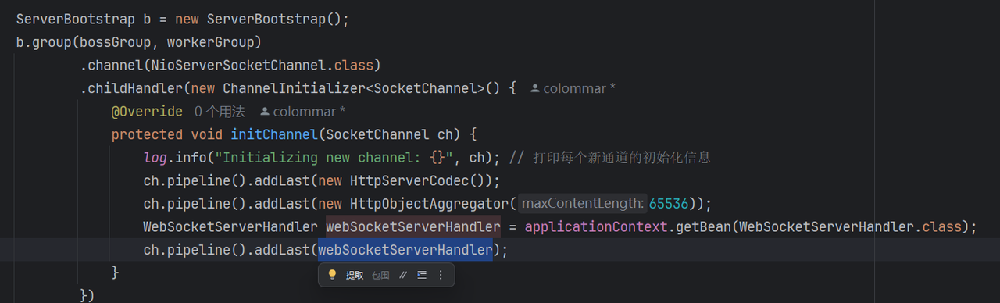
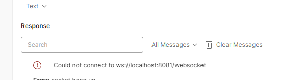
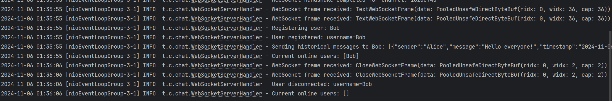

# Spring

## Spring 的 Bean 是单例的

### 问题背景

在使用 **Netty** 时，每个 WebSocket 连接对应一个 `ChannelPipeline`，而 Spring 的 Bean 默认是单例模式。当将单例的 Spring Bean（如 `WebsocketServerHandler`）添加到 Netty 的 `ChannelPipeline` 时，会导致以下问题：

- **现象**：在使用 Netty 开发聊天室作业时，通过 Bean 自动注入 `WebsocketServerHandler`，发现每次只能建立一个 WebSocket 连接，断开后也无法复用。
- **代码关键点**：`initChannel` 方法中调用 `ch.pipeline().addLast(WebsocketServerHandler())`。
- **问题复现**：
  1. 第一次 WebSocket 连接成功。
  2. 断开连接后，无法建立新的连接。
  3. 日志显示 `initial new channel` 但没有触发 `channelRead`。
  
这一问题明确指出：**Spring 的 Bean 是单例模式，无法适应 Netty 对每个连接独立上下文的需求**。

### 单例模式简介

单例模式是一种软件设计模式，保证一个类只有一个实例并提供全局访问点。其主要优点包括：
- **统一管理**：如配置管理统一通过单例对象获取。
- **资源节省**：减少对象创建开销。

然而，**单例模式**在并发场景下容易引发问题，特别是在需要独立上下文的框架（如 Netty）中。
- Bean注入：

在第一次websocket连接之后，无法再次连接上，也无法复用。

在每一处都打上了log，但发现接收不到websocket的连接请求。
然而，我给我的chatserver打了个log，发现只有 initial new channel，但是没有channelRead。

---

### 问题分析

#### 1. **线程安全问题**
- 单例 Bean 在多个线程中共享，若包含实例变量（如用户状态），可能引发数据竞争和状态污染。

#### 2. **连接独立性缺失**
- 每个 WebSocket 连接需要独立上下文，而单例 Bean 共享状态，无法为每个连接提供独立的 Handler 实例。

---

### 解决方案分析

| **方案**                  | **优点**                             | **缺点**                                | **适用场景**                               |
|---------------------------|--------------------------------------|-----------------------------------------|--------------------------------------------|
| **多例模式（Prototype）**  | 独立实例，支持不同上下文             | 配置复杂，需动态获取 Bean               | 每个连接需要独立状态或上下文时优先考虑     |
| **动态实例化 Handler**     | 灵活创建 Bean，与 Spring 容器集成    | 容器注入时机复杂                        | 动态加载或依赖 Spring 管理生命周期的场景   |
| **无状态设计**             | 简化 Bean 状态，线程安全             | 设计复杂，状态需外部维护                | 适用于 Handler 状态较少或无状态的场景      |
| **线程安全机制**           | 提供共享 Handler 的线程安全保障      | 复杂度高，易误用线程安全工具            | 共享资源或优化性能时需要严格控制线程安全   |
| **直接 new 一个 Handler**  | 简单直接，快速实现                  | 脱离 Spring 管理，扩展性受限            | 简单场景或快速实现原型时的应急方案         |

#### 解决方法细节

1. **多例模式（Prototype Scope）**
   - 配置 `WebsocketServerHandler` 为多例，确保每次连接创建新的实例：
     ```java
     @Component
     @Scope("prototype")
     public class WebsocketServerHandler extends SimpleChannelInboundHandler<String> {
         private String userId; // 每个实例独立
     }
     ```
   - **注意事项**：`@Scope("prototype")` 的 Bean 不能直接通过 `@Autowired` 注入，而需通过 `ApplicationContext` 动态获取。

2. **动态实例化 Handler**
   - 使用 Spring 的 `ApplicationContext` 动态创建 Handler 实例：
     ```java
     @Autowired
     private ApplicationContext applicationContext;

     @Override
     protected void initChannel(SocketChannel ch) {
         WebsocketServerHandler handler = applicationContext.getBean(WebsocketServerHandler.class);
         ch.pipeline().addLast(handler);
     }
     ```
   - **关键点**：确保 Spring 容器加载完毕，Bean 定义正确。

3. **无状态设计**
   - 将 `WebsocketServerHandler` 设计为无状态：
     ```java
     @Component
     @Sharable
     public class WebsocketServerHandler extends SimpleChannelInboundHandler<String> {
         @Override
         protected void channelRead0(ChannelHandlerContext ctx, String msg) {
             String userId = extractUserIdFromMessage(msg); // 状态通过方法参数传递
         }
     }
     ```
   - **适用场景**：Handler 状态依赖较少，且能通过方法参数动态传递。

4. **线程安全机制**
   - 使用线程安全的数据结构（如 `ConcurrentHashMap`）存储状态，或通过 `@Sharable` 确保安全共享。
   - **示例**：
     ```java
     @Component
     @Sharable
     public class WebsocketServerHandler extends SimpleChannelInboundHandler<String> {
         private final ConcurrentHashMap<String, String> userStates = new ConcurrentHashMap<>();

         @Override
         protected void channelRead0(ChannelHandlerContext ctx, String msg) {
             userStates.put(ctx.channel().id().asShortText(), msg); // 线程安全
         }
     }
     ```

5. **直接 new 一个 Handler**
   - 可在 `initChannel` 方法中直接创建新的 Handler 实例：
     ```java
     @Override
     protected void initChannel(SocketChannel ch) {
         ch.pipeline().addLast(new WebsocketServerHandler());
     }
     ```
   - **缺点**：违背 Spring 管理原则，不推荐在复杂场景中使用。

